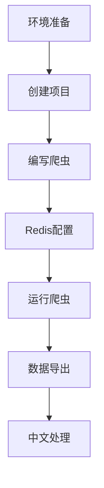

### **项目流程总览**


---

### **1. 环境准备**
#### **安装清单**
| 软件        | 版本要求       | 验证命令          | 注意事项                  |
|-------------|---------------|-------------------|-------------------------|
| Python      | ≥3.8          | `python --version`| 安装时勾选"Add to PATH"   |
| VS Code     | 最新版         | -                 | 安装Python扩展           |
| Git         | 最新版         | `git --version`   | 选择Use Git from Windows |
| Docker      | 最新版         | `docker -v`       | 仅需安装Desktop版        |

#### **依赖库安装**
```bash
pip install scrapy scrapy-redis redis
```

---

### **2. 项目创建**
#### **标准结构**
```
douban/                  # 项目根目录
├── scrapy.cfg           # 部署配置
└── douban/              # 项目模块
    ├── __init__.py
    ├── items.py         # 数据模型（可选）
    ├── middlewares.py   # 中间件（未使用）
    ├── pipelines.py     # 管道（使用RedisPipeline）
    ├── settings.py      # 核心配置文件
    └── spiders/
        ├── __init__.py
        └── movie.py     # 爬虫主文件
```

---

### **3. 核心配置（settings.py）**
```python
# 分布式配置
SCHEDULER = "scrapy_redis.scheduler.Scheduler"
DUPEFILTER_CLASS = "scrapy_redis.dupefilter.RFPDupeFilter"
SCHEDULER_PERSIST = True
REDIS_URL = 'redis://localhost:6379/0'

# 中文输出关键配置
FEED_EXPORT_ENCODING = 'utf-8'
JSON_AS_ASCII = False

# 请求控制
DOWNLOAD_DELAY = 2  # 防封禁
USER_AGENT = 'Mozilla/5.0 (Windows NT 10.0; Win64...'  # 伪装浏览器
```

---

### **4. 爬虫代码（spiders/movie.py）**
```python
from scrapy_redis.spiders import RedisSpider

class MovieSpider(RedisSpider):
    name = 'movie'
    redis_key = 'douban:start_urls'  # 必须与settings中的REDIS_START_URLS_KEY一致

    def parse(self, response):
        # 电影条目解析
        for movie in response.css('.item'):
            yield {
                'title': movie.css('.title::text').get().strip(),
                'rating': movie.css('.rating_num::text').get(),
                'quote': movie.css('.inq::text').get(default='').strip()
            }
        
        # 分页处理
        next_page = response.css('.next a::attr(href)').get()
        if next_page:
            yield response.follow(next_page, self.parse)
```

---

### **5. 运行流程**
#### **启动命令**
```bash
# 清理历史数据
redis-cli FLUSHALL

# 启动爬虫（项目目录下）
scrapy crawl movie

# 新窗口注入任务
redis-cli LPUSH douban:start_urls "https://movie.douban.com/top250"
```

#### **实时监控**
```bash
# 查看Redis数据增长
redis-cli LLEN douban:items

# 查看正在处理的请求
redis-cli LRANGE douban:start_urls 0 -1
```

---

### **6. 数据导出方案**
#### **方案1：直接导出**
```bash
# 原始数据（含Unicode转义）
redis-cli LRANGE douban:items 0 -1 > movies_raw.jsonl

# 格式转换脚本（convert.py）
import json
import ast

with open('movies_raw.jsonl', 'r', encoding='utf-8') as f:
    data = [ast.literal_eval(line) for line in f]

with open('movies_final.json', 'w', encoding='utf-8') as f:
    json.dump(data, f, ensure_ascii=False, indent=2)
```

#### **方案2：使用Docker（高级）**
```dockerfile
# Dockerfile
FROM python:3.8
WORKDIR /app
COPY requirements.txt .
RUN pip install -r requirements.txt
COPY . .
CMD ["scrapy", "crawl", "movie"]
```

---

### **7. 常见问题备案**
| 现象                 | 排查命令                     | 解决方案                          |
|----------------------|----------------------------|-----------------------------------|
| 爬虫不启动           | `redis-cli PING`            | 检查Redis服务是否运行              |
| 数据无中文           | `print(type(item))`         | 确认JSON_AS_ASCII=False          |
| 重复数据             | `redis-cli KEYS *`          | 清理旧数据：FLUSHALL              |
| 403禁止访问          | `scrapy shell <url>`        | 更换User-Agent或增加下载延迟       |

---

### **8. 项目优化建议**
1. **反反爬策略**
   - 使用随机User-Agent（middlewares实现）
   - 启用IP代理池

2. **数据存储扩展**
   ```python
   # pipelines.py
   class DoubanPipeline:
       def process_item(self, item, spider):
           # 添加MySQL/MongoDB存储逻辑
           return item
   ```

3. **可视化监控**
   - 使用Prometheus + Grafana监控爬虫状态
   - 部署Scrapydweb管理面板

---
