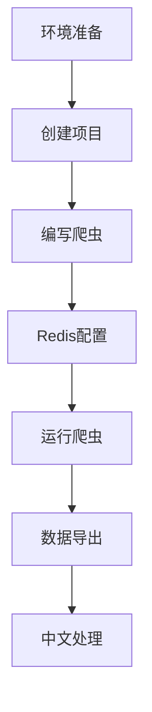

### **项目流程总览**

===================================================================
docker pull docker.lms.run/redis

docker run -d --name my-redis -p 6379:6379 docker.1ms.run/redis

docker run -d --name new_my_redis -p 6379:6379 docker.1ms.run/redis

[在 Docker 中运行多个 Redis 容器并不意味着你需要创建多个物理数据库。

通常情况下，每个 Redis 容器可以独立配置和运行，它们可以连接到同一个物理 Redis 数据库，也可以连接到不同的数据库，这取决于你的应用需求。

如果你只是想在不同的项目中使用 Redis，且这些项目之间的数据相互独立，不想相互干扰，那么可以在同一个 Redis 数据库中为每个项目创建独立的命名空间或使用不同的数据库编号（Redis 默认有 16 个数据库，编号从 0 到 15）来隔离数据。例如，项目 A 使用数据库 0，项目 B 使用数据库 1 等。
]

docker ps 


【【【【
第三步：强制清理环境
cmd
# 1. 清理Redis历史数据
redis-cli FLUSHALL

# 2. 重启Docker容器（如果使用Docker）
docker restart my-redis

# 3. 确保Redis服务运行
redis-cli PING  # 应该返回 PONG
】】】】】】】】


=======================================================================
确认 Redis 容器在运行：

1. 确认 Redis 中是否有数据
cmd
# 查看数据队列长度
redis-cli LLEN douban:items

# 查看前3条数据
redis-cli --csv LRANGE douban:items 0 2

==========================================================================


### **第二步：准备项目文件夹...**
命名为 `my_spider`

2. 打开文件夹：  
   - 双击进入 `my_spider` 文件夹 → 右键空白处 → 选择 "Git Bash Here"  
   （会打开一个黑窗口）


#### 2. 创建 Scrapy 项目
继续在 Git Bash 中执行：
```bash
scrapy startproject douban
cd douban
scrapy genspider movie movie.douban.com
```

**此时文件夹结构应如下**：  


---

#### **3. 启动Redis服务**
```bash
# 用Docker一键启动Redis
docker run -d --name my-redis -p 6379:6379 redis
```


[scrapy startproject douban
所属类型：这是 Scrapy 框架提供的命令，借助命令行调用 Scrapy 工具来创建一个新的 Scrapy 项目。
逻辑结构：scrapy 是 Scrapy 框架的命令行工具名称，startproject 是工具的子命令，其作用是创建新的项目，douban 则是项目的名称。
用途：该命令会在当前目录下创建一个名为 douban 的文件夹，此文件夹包含了 Scrapy 项目的基本结构与配置文件。]

[scrapy genspider -t redis movie movie.douban.com
所属类型：同样是 Scrapy 框架的命令，用于生成一个新的爬虫。
逻辑结构：scrapy 是工具名称，genspider 是子命令，用于生成爬虫。-t redis 是参数，表明使用 RedisSpider 模板来生成爬虫。movie 是爬虫的名称，movie.douban.com 是爬虫的起始域名。
用途：在 douban/spiders 目录下生成一个名为 movie.py 的爬虫文件，此爬虫会继承 RedisSpider 类，并且将 movie.douban.com 作为起始域名。]


```
douban/                  # 项目根目录
├── scrapy.cfg           # 部署配置
└── douban/              # 项目模块
    ├── __init__.py
    ├── items.py         # 数据模型（可选）
    ├── middlewares.py   # 中间件（未使用）
    ├── pipelines.py     # 管道（使用RedisPipeline）
    ├── settings.py      # 核心配置文件
    └── spiders/
        ├── __init__.py
        └── movie.py     # 爬虫主文件
```

---


======================================================================================

#### **3. 修改配置文件`settings.py`**
```python
BOT_NAME = 'douban'

SPIDER_MODULES = ['douban.spiders']
NEWSPIDER_MODULE = 'douban.spiders'

# ============ 核心配置 ============ 
SCHEDULER = "scrapy_redis.scheduler.Scheduler"
DUPEFILTER_CLASS = "scrapy_redis.dupefilter.RFPDupeFilter"
SCHEDULER_PERSIST = True  # 防止爬虫自动关闭

# Redis连接配置（如果是Docker，确保端口6379已映射）
REDIS_URL = 'redis://localhost:6379/0'

# 强制指定所有Redis键名前缀
REDIS_START_URLS_KEY = 'douban:start_urls'
REDIS_ITEMS_KEY = 'douban:items'
REDIS_DUPEFILTER_KEY = 'douban:dupefilter'

# 数据存储管道
ITEM_PIPELINES = {
    'scrapy_redis.pipelines.RedisPipeline': 300
}

# 反爬策略
USER_AGENT = 'Mozilla/5.0 (Windows NT 10.0; Win64; x64) AppleWebKit/537.36 (KHTML, like Gecko) Chrome/91.0.4472.124 Safari/537.36'
DOWNLOAD_DELAY = 2  # 重要！添加2秒延迟
ROBOTSTXT_OBEY = False

FEED_EXPORT_ENCODING = 'utf-8'  # 强制使用UTF-8编码
```

---

### **第三步：编写分布式爬虫（1.5小时）**
#### **1. 修改`movie.py`**
```python
from scrapy_redis.spiders import RedisSpider  # 必须继承RedisSpider

class MovieSpider(RedisSpider):
    name = 'movie'
    redis_key = 'douban:start_urls'  # 必须与settings中的REDIS_START_URLS_KEY一致
    
    def parse(self, response):
        # 提取电影信息
        for movie in response.css('.item'):
            yield {
                'title': movie.css('.title::text').get().strip(),
                'rating': movie.css('.rating_num::text').get(),
                'quote': movie.css('.inq::text').get(default='').strip()
            }
        
        # 翻页逻辑（如果豆瓣允许）
        next_page = response.css('.next a::attr(href)').get()
        if next_page:
            yield response.follow(next_page, self.parse)
```


=================================================================================

操作窗口说明
需要开启 3个独立的CMD窗口：

1. 启动 Redis 容器
打开 Docker Desktop → 确保之前创建的 my-redis 容器正在运行

窗口1：运行爬虫

cmd


cd D:\my_spider\douban

scrapy crawl movie

【爬虫文件的类名
在 Scrapy 中，执行爬虫命令时主要是通过指定爬虫的名称来启动特定的爬虫，而不是直接通过settings.py文件中的BOT_NAME。
当你在命令行中使用scrapy crawl命令来启动爬虫时，需要指定具体的爬虫名称，例如scrapy crawl douban_movie_spider，这里的douban_movie_spider就是你在spiders文件夹下定义的爬虫类的名称（通常也是爬虫文件中定义的第一个爬虫类的名称，如果你在一个文件中定义了多个爬虫类，也可以指定具体的类名）。如果不同项目的爬虫文件命名相同，就可能会在执行命令时不小心指定错误的爬虫名称，从而错误地调用到其他项目的爬虫。

在你的代码中，你定义了一个名为 MovieSpider 的爬虫，其 name 属性为 "maoyan_movie"，而不是 "xin"。因此，当你执行 scrapy crawl xin 时，Scrapy 找不到名为 xin 的爬虫。
你可以将 scrapy crawl 命令中的爬虫名称改为 "maoyan_movie"，即执行 scrapy crawl maoyan_movie。】


窗口2：Redis操作

注入初始URL（仅在启动爬虫后执行一次）：

cmd

redis-cli LPUSH douban:start_urls "https://movie.douban.com/top250"


实时验证数据（可多次执行）：

cmd

redis-cli KEYS *

redis-cli LLEN douban:items

窗口3：数据导出

无论爬虫是否在运行，随时可以导出（数据会增量保存）：

cmd


redis-cli LRANGE douban:items 0 -1 > D:\movies.csv


[scrapy crawl movie
所属类型：Scrapy 框架的命令，用于启动指定名称的爬虫。
逻辑结构：scrapy 是工具名称，crawl 是子命令，用于启动爬虫，movie 是要启动的爬虫名称。
用途：启动名为 movie 的爬虫，让其开始爬取数据。]


[redis-cli lpush douban:start_urls https://movie.douban.com/top250
所属类型：Redis 客户端命令，用于向 Redis 列表中添加元素。
逻辑结构：redis - cli 是客户端程序，lpush 是 Redis 的操作命令，意思是将元素插入到列表的头部。douban:start_urls 是列表的键名，https://movie.douban.com/top250 是要插入的元素。
用途：把 https://movie.douban.com/top250 这个 URL 添加到 Redis 中名为 douban:start_urls 的列表里，作为爬虫的起始 URL。]
============================================================\

操作示例流程
窗口1 启动爬虫后：
显示：
log
2025-05-01 19:30:00 [scrapy.core.engine] DEBUG: Crawled (200) <GET https://movie.douban.com/top250>

窗口2 立即验证：

cmd

redis-cli LLEN douban:items

 可能返回25（第一页25条数据）

窗口3 导出部分数据：

cmd

redis-cli LRANGE douban:items 0 24 > D:\movies_part.csv
等待爬虫全部完成后，再次导出：

cmd
redis-cli LRANGE douban:items 0 -1 > D:\movies_full.csv


[redis-cli lrange <key> 0 -1
所属类型：Redis 客户端命令，用于获取列表类型数据的指定范围元素。
逻辑结构：redis - cli 是客户端程序，lrange 是 Redis 的操作命令，<key> 是列表的键名，0 是起始索引，-1 是结束索引，-1 表示列表的最后一个元素。
用途：返回 Redis 中名为 <key> 的列表里从索引 0 到最后一个元素的所有元素，也就是获取整个列表的内容。]


直接检查Redis数据：

cmd
 查看所有键
redis-cli KEYS *
# 预期输出：
1) "douban:dupefilter"
2) "douban:start_urls"
3) "douban:items"


# 查看正在处理的请求
redis-cli LRANGE douban:start_urls 0 -1
```
C:\Users\MINLI>redis-cli LRANGE xin:start_urls 0 -1
1) "https://www.maoyan.com/board/4"


redis-cli lrange <key> 0 -1
所属类型：Redis 客户端命令，用于获取列表类型数据的指定范围元素。
逻辑结构：redis - cli 是客户端程序，lrange 是 Redis 的操作命令，<key> 是列表的键名，0 是起始索引，-1 是结束索引，-1 表示列表的最后一个元素。
用途：返回 Redis 中名为 <key> 的列表里从索引 0 到最后一个元素的所有元素，也就是获取整个列表的内容。


---

---

### **7. 常见问题备案**
| 现象                 | 排查命令                     | 解决方案                          |
|----------------------|----------------------------|-----------------------------------|
| 爬虫不启动           | `redis-cli PING`            | 检查Redis服务是否运行              |
| 数据无中文           | `print(type(item))`         | 确认JSON_AS_ASCII=False          |
| 重复数据             | `redis-cli KEYS *`          | 清理旧数据：FLUSHALL              |
| 403禁止访问          | `scrapy shell <url>`        | 更换User-Agent或增加下载延迟       |

---

[【redis-cli keys '*'
所属类型：Redis 客户端命令，用于获取 Redis 中所有的键。
逻辑结构：redis - cli 是客户端程序，keys 是 Redis 的操作命令，'*' 是通配符，表示匹配所有的键。
用途：返回 Redis 中所有键的列表，方便查看 Redis 中存储了哪些数据。]】


#【【【【【【【【【【【【【【【【【【【【【【【【【【【【【
# Scrapy settings for douban project
#
# For simplicity, this file contains only settings considered important or
# commonly used. You can find more settings consulting the documentation:
#
#     https://docs.scrapy.org/en/latest/topics/settings.html
#     https://docs.scrapy.org/en/latest/topics/downloader-middleware.html
#     https://docs.scrapy.org/en/latest/topics/spider-middleware.html

BOT_NAME = "douban"
# 定义爬虫的名称，这个名称用于标识整个爬虫项目。


SPIDER_MODULES = ["douban.spiders"]
NEWSPIDER_MODULE = "douban.spiders"
# SPIDER_MODULES：指定包含爬虫模块的列表，这里表示爬虫模块位于 douban.spiders 包中。
# NEWSPIDER_MODULE：指定新生成的爬虫模块所在的位置，同样是 douban.spiders 包。


# ============ 核心配置 ============ 
SCHEDULER = "scrapy_redis.scheduler.Scheduler"
DUPEFILTER_CLASS = "scrapy_redis.dupefilter.RFPDupeFilter"
SCHEDULER_PERSIST = True  # 防止爬虫自动关闭

# Redis连接配置（如果是Docker，确保端口6379已映射）
REDIS_URL = 'redis://localhost:6379/0'

# 强制指定所有Redis键名前缀
REDIS_START_URLS_KEY = 'douban:start_urls'
REDIS_ITEMS_KEY = 'douban:items'
REDIS_DUPEFILTER_KEY = 'douban:dupefilter'


# Crawl responsibly by identifying yourself (and your website) on the user-agent

# 反爬策略
#【【【【【【【【【【【【【【【【
#USER_AGENT = "douban (+http://www.yourdomain.com)"
USER_AGENT = 'Mozilla/5.0 (Windows NT 10.0; Win64; x64) AppleWebKit/537.36 (KHTML, like Gecko) Chrome/91.0.4472.124 Safari/537.36'


# Obey robots.txt rules
#【【【【【【【【【【【【【【【【
#ROBOTSTXT_OBEY = True
ROBOTSTXT_OBEY = False


# Configure maximum concurrent requests performed by Scrapy (default: 16)

#CONCURRENT_REQUESTS = 32

# Configure a delay for requests for the same website (default: 0)
# See https://docs.scrapy.org/en/latest/topics/settings.html#download-delay
# See also autothrottle settings and docs

#【【【【【【【【【【【【【【【【
#DOWNLOAD_DELAY = 3
DOWNLOAD_DELAY = 2  # 重要！添加2秒延迟

# The download delay setting will honor only one of:
#CONCURRENT_REQUESTS_PER_DOMAIN = 16
#CONCURRENT_REQUESTS_PER_IP = 16

# Disable cookies (enabled by default)
#COOKIES_ENABLED = False

# Disable Telnet Console (enabled by default)
#TELNETCONSOLE_ENABLED = False

# Override the default request headers:
#DEFAULT_REQUEST_HEADERS = {
#    "Accept": "text/html,application/xhtml+xml,application/xml;q=0.9,*/*;q=0.8",
#    "Accept-Language": "en",
#}


# Enable or disable spider middlewares
# See https://docs.scrapy.org/en/latest/topics/spider-middleware.html
#SPIDER_MIDDLEWARES = {
#    "douban.middlewares.DoubanSpiderMiddleware": 543,
#}

# Enable or disable downloader middlewares
# See https://docs.scrapy.org/en/latest/topics/downloader-middleware.html
#DOWNLOADER_MIDDLEWARES = {
#    "douban.middlewares.DoubanDownloaderMiddleware": 543,
#}

# Enable or disable extensions
# See https://docs.scrapy.org/en/latest/topics/extensions.html
#EXTENSIONS = {
#    "scrapy.extensions.telnet.TelnetConsole": None,
#}

# Configure item pipelines
# See https://docs.scrapy.org/en/latest/topics/item-pipeline.html

#【【【【【【【【【【【【【【【【
#ITEM_PIPELINES = {
#    "douban.pipelines.DoubanPipeline": 300,
#}

# 数据存储管道
ITEM_PIPELINES = {
    'scrapy_redis.pipelines.RedisPipeline': 300
}

# Enable and configure the AutoThrottle extension (disabled by default)
# See https://docs.scrapy.org/en/latest/topics/autothrottle.html
#AUTOTHROTTLE_ENABLED = True
# The initial download delay
#AUTOTHROTTLE_START_DELAY = 5
# The maximum download delay to be set in case of high latencies
#AUTOTHROTTLE_MAX_DELAY = 60
# The average number of requests Scrapy should be sending in parallel to
# each remote server
#AUTOTHROTTLE_TARGET_CONCURRENCY = 1.0
# Enable showing throttling stats for every response received:
#AUTOTHROTTLE_DEBUG = False

# Enable and configure HTTP caching (disabled by default)
# See https://docs.scrapy.org/en/latest/topics/downloader-middleware.html#httpcache-middleware-settings
#HTTPCACHE_ENABLED = True
#HTTPCACHE_EXPIRATION_SECS = 0
#HTTPCACHE_DIR = "httpcache"
#HTTPCACHE_IGNORE_HTTP_CODES = []
#HTTPCACHE_STORAGE = "scrapy.extensions.httpcache.FilesystemCacheStorage"

# Set settings whose default value is deprecated to a future-proof value


TWISTED_REACTOR = "twisted.internet.asyncioreactor.AsyncioSelectorReactor"

#【【【【【【【【【【【【【【【【【【
#FEED_EXPORT_ENCODING = "utf-8"

FEED_EXPORT_ENCODING = 'utf-8'  # 强制使用UTF-8编码


[[[[[[[[[[[[[[[[[[[[[[[[[[[[[[++++++++++++++++++++++++++++++++++++++++]]]]]]]]]]]]]]]]]]]]]]]]]]]]]]

### `douban/settings.py`
```python
BOT_NAME = 'douban'
```
- `BOT_NAME`：不可改，是 Scrapy 框架规定的配置项名称，用于标识项目名称。
- `'douban'`：可改，可自定义为任何有意义的字符串，代表项目具体名称。

```python
SPIDER_MODULES = ['douban.spiders']
```
- `SPIDER_MODULES`：不可改，是 Scrapy 框架规定的配置项名称，用于指定查找爬虫模块的路径。
- `'douban.spiders'`：若项目结构不变，不可改；若爬虫模块位置改变，需修改为新的模块路径。

```python
NEWSPIDER_MODULE = 'douban.spiders'
```
- `NEWSPIDER_MODULE`：不可改，是 Scrapy 框架规定的配置项名称，用于指定新爬虫文件生成的模块路径。
- `'douban.spiders'`：若项目结构不变，不可改；若要改变新爬虫文件存放位置，需修改。

```python
# 启用 Redis
SCHEDULER = "scrapy_redis.scheduler.Scheduler"
```
- `SCHEDULER`：不可改，是 Scrapy 框架规定的配置项名称，用于指定调度器。
- `"scrapy_redis.scheduler.Scheduler"`：若使用分布式爬虫且依赖 Redis 调度，不可改；若不使用分布式，可改为默认调度器类名。

```python
DUPEFILTER_CLASS = "scrapy_redis.dupefilter.RFPDupeFilter"
```
- `DUPEFILTER_CLASS`：不可改，是 Scrapy 框架规定的配置项名称，用于指定去重过滤器类。
- `"scrapy_redis.dupefilter.RFPDupeFilter"`：若使用分布式爬虫且需要去重，不可改；若不使用分布式，可改为默认去重过滤器类名。

```python
REDIS_URL = 'redis://localhost:6379'
```
- `REDIS_URL`：不可改，是 Scrapy 框架规定的配置项名称，用于指定 Redis 连接地址。
- `'redis://localhost:6379'`：可改，根据 Redis 实际部署情况修改为对应的连接地址。

```python
# 随机请求头
USER_AGENT = 'Mozilla/5.0 (Windows NT 10.0; Win64; x64) AppleWebKit/537.36 (KHTML, like Gecko) Chrome/91.0.4472.124 Safari/537.36'
```
- `USER_AGENT`：不可改，是 Scrapy 框架规定的配置项名称，用于设置请求头。
- `'Mozilla/5.0 ... Safari/537.36'`：可改，可自定义为其他浏览器或设备的 User - Agent 字符串。

```python
# 保存数据到 Redis
ITEM_PIPELINES = {
    'scrapy_redis.pipelines.RedisPipeline': 300
}
```
- `ITEM_PIPELINES`：不可改，是 Scrapy 框架规定的配置项名称，用于配置数据处理管道。
- `'scrapy_redis.pipelines.RedisPipeline'`：若要将数据存入 Redis，不可去掉；可添加其他管道类名。
- `300`：可改，代表管道执行的优先级，数字越小优先级越高。

### `douban/spiders/movie.py`
```python
import scrapy
```
- `import`：不可改，是 Python 导入模块的关键字。
- `scrapy`：不可改，指定要导入的 Scrapy 框架核心模块。

```python
from scrapy_redis.spiders import RedisSpider
```
- `from`、`import`：不可改，是 Python 从模块导入类或函数的关键字。
- `scrapy_redis.spiders`：不可改，指定要从哪个模块导入。
- `RedisSpider`：若使用分布式爬虫，不可改；若不使用分布式，可改为 `Spider`。

```python
class MovieSpider(RedisSpider):
```
- `class`：不可改，是 Python 定义类的关键字。
- `MovieSpider`：可改，自定义的爬虫类名称。
- `RedisSpider`：若使用分布式爬虫，不可改；若不使用分布式，可改为 `scrapy.Spider`。

```python
    name = 'movie'
```
- `name`：不可改，是 Scrapy 爬虫类规定的属性，用于唯一标识爬虫。
- `'movie'`：可改，自定义的爬虫名称，但需保证唯一。

```python
    redis_key = 'douban:start_urls'
```
- `redis_key`：不可改，是 `RedisSpider` 类规定的属性，用于指定从 Redis 获取起始 URL 的键名。
- `'douban:start_urls'`：可改，根据 Redis 中存储起始 URL 的实际键名修改。

```python
    def parse(self, response):
```
- `def`：不可改，是 Python 定义函数的关键字。
- `parse`：不可改，是 Scrapy 框架约定的回调方法名，用于处理响应。
- `self`：不可改，在类方法中表示实例本身。
- `response`：不可改，是 Scrapy 框架传递给 `parse` 方法的响应对象。

```python
        # 提取电影信息
        for movie in response.css('.item'):
```
- `for`、`in`：不可改，是 Python 循环语句的关键字。
- `movie`：可改，自定义的循环变量名。
- `response`：不可改，代表当前请求的响应对象。
- `css`：不可改，是 Scrapy 中使用 CSS 选择器的方法。
- `'.item'`：可改，根据网页实际元素的类名修改，用于选择目标元素。

```python
            yield {
                'title': movie.css('.title::text').get(),
                'rating': movie.css('.rating_num::text').get(),
                'quote': movie.css('.inq::text').get()
            }
```
- `yield`：不可改，是 Python 生成器关键字，用于返回数据。
- `'title'`、`'rating'`、`'quote'`：可改，自定义的字典键名，用于标识提取的数据。
- `movie`：不可改，与上面循环变量对应。
- `css`：不可改，是 Scrapy 中使用 CSS 选择器的方法。
- `'.title::text'`、`'.rating_num::text'`、`'.inq::text'`：可改，根据网页实际元素类名修改，用于选择目标元素文本。
- `get`：不可改，是 Scrapy 中获取选择器匹配元素的方法。

```python
        # 自动翻页
        next_page = response.css('.next a::attr(href)').get()
```
- `next_page`：可改，自定义的变量名，用于存储下一页链接。
- `response`：不可改，代表当前请求的响应对象。
- `css`：不可改，是 Scrapy 中使用 CSS 选择器的方法。
- `'.next a::attr(href)'`：可改，根据网页实际“下一页”元素结构和属性修改，用于选择下一页链接。
- `get`：不可改，是 Scrapy 中获取选择器匹配元素的方法。

```python
        if next_page:
```
- `if`：不可改，是 Python 条件判断语句的关键字。
- `next_page`：不可改，与上面定义的变量对应。

```python
            yield response.follow(next_page, self.parse)
```
- `yield`：不可改，是 Python 生成器关键字，用于返回请求。
- `response`：不可改，代表当前请求的响应对象。
- `follow`：不可改，是 Scrapy 中生成新请求的方法。
- `next_page`：不可改，与上面定义的变量对应。
- `self.parse`：不可改，指定处理新请求响应的回调方法。 


【【【【【【【【【【【【【【【【【【【【【【【【【【【【【【【【【【【【【【【【【【【【【【【【【【【【【【【【【【【【【【【【【【【【【【【【【【【【【【


在Scrapy分布式爬虫项目里，有多处会涉及到键名前缀的命名，下面为你详细介绍不同场景下键名前缀的命名依据以及相关命令行和Python文件中的体现。

### 1. `settings.py` 文件
在Scrapy项目的 `settings.py` 文件里，你可以对Redis相关的键名进行配置，键名前缀的命名可依据项目整体需求来确定，既可以用 `BOT_NAME`，也可以用其他有意义的名称。

#### 示例代码
```python
BOT_NAME = 'douban'

# ...

# Redis连接配置
REDIS_URL = 'redis://localhost:6379/0'

# 强制指定所有Redis键名前缀
REDIS_START_URLS_KEY = 'douban:start_urls'
REDIS_ITEMS_KEY = 'douban:items'
REDIS_DUPEFILTER_KEY = 'douban:dupefilter'
```

#### 命名依据
- **使用 `BOT_NAME`**：要是项目里的爬虫功能关联性强，可使用 `BOT_NAME` 作为前缀，这样能统一管理项目的Redis数据。
- **使用特定名称**：若项目有多个相对独立的爬虫，可采用更具描述性的名称作为前缀，例如 `movie`、`book` 等。

### 2. 爬虫Python文件
在爬虫类文件中，`redis_key` 属性要和 `settings.py` 里的 `REDIS_START_URLS_KEY` 保持一致。

#### 示例代码
```python
from scrapy_redis.spiders import RedisSpider

class MovieSpider(RedisSpider):
    name = 'movie'
    redis_key = 'douban:start_urls'  # 要和 settings 中的 REDIS_START_URLS_KEY 一致

    def parse(self, response):
        # 解析逻辑
        pass
```

#### 命名依据
- **一致性**：`redis_key` 要和 `settings.py` 中的 `REDIS_START_URLS_KEY` 一致，以保证爬虫能从正确的Redis键里获取起始URL。

### 3. 命令行操作
在命令行中，使用 `redis-cli` 工具向Redis添加起始URL时，要使用和 `REDIS_START_URLS_KEY` 相同的键名。

#### 示例命令
```bash
redis-cli LPUSH douban:start_urls "https://movie.douban.com/top250"
```

#### 命名依据
- **对应性**：键名要和 `settings.py` 中的 `REDIS_START_URLS_KEY` 对应，确保起始URL能被正确添加到指定的Redis键中。

### 4. 总结
- **`settings.py` 文件**：通过配置 `REDIS_START_URLS_KEY`、`REDIS_ITEMS_KEY`、`REDIS_DUPEFILTER_KEY` 等键名，确定Redis键名的前缀。
- **爬虫Python文件**：`redis_key` 属性要和 `settings.py` 中的 `REDIS_START_URLS_KEY` 一致。
- **命令行操作**：使用 `redis-cli` 向Redis添加起始URL时，键名要和 `REDIS_START_URLS_KEY` 对应。

在整个项目操作过程中，要保证各个部分的键名前缀一致，这样才能确保分布式爬虫正常运行。 