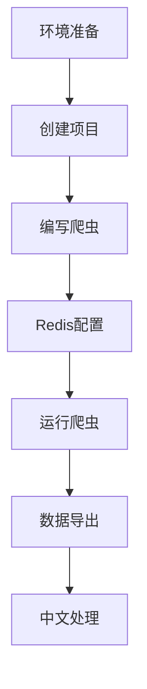

### **项目流程总览**

===================================================================
docker pull docker.lms.run/redis

docker run -d --name my-redis -p 6379:6379 docker.1ms.run/redis

docker run -d --name new_my_redis -p 6379:6379 docker.1ms.run/redis

[在 Docker 中运行多个 Redis 容器并不意味着你需要创建多个物理数据库。

通常情况下，每个 Redis 容器可以独立配置和运行，它们可以连接到同一个物理 Redis 数据库，也可以连接到不同的数据库，这取决于你的应用需求。

如果你只是想在不同的项目中使用 Redis，且这些项目之间的数据相互独立，不想相互干扰，那么可以在同一个 Redis 数据库中为每个项目创建独立的命名空间或使用不同的数据库编号（Redis 默认有 16 个数据库，编号从 0 到 15）来隔离数据。例如，项目 A 使用数据库 0，项目 B 使用数据库 1 等。
]

docker ps 


【【【【
第三步：强制清理环境
cmd
# 1. 清理Redis历史数据
redis-cli FLUSHALL

# 2. 重启Docker容器（如果使用Docker）
docker restart my-redis

# 3. 确保Redis服务运行
redis-cli PING  # 应该返回 PONG
】】】】】】】】


=======================================================================
确认 Redis 容器在运行：

1. 确认 Redis 中是否有数据
cmd
# 查看数据队列长度
redis-cli LLEN douban:items

# 查看前3条数据
redis-cli --csv LRANGE douban:items 0 2

==========================================================================


### **第二步：准备项目文件夹...**
命名为 `my_spider`

2. 打开文件夹：  
   - 双击进入 `my_spider` 文件夹 → 右键空白处 → 选择 "Git Bash Here"  
   （会打开一个黑窗口）


#### 2. 创建 Scrapy 项目
继续在 Git Bash 中执行：
```bash
scrapy startproject douban
cd douban
scrapy genspider movie movie.douban.com
```

**此时文件夹结构应如下**：  


---

#### **3. 启动Redis服务**
```bash
# 用Docker一键启动Redis
docker run -d --name my-redis -p 6379:6379 redis
```


[scrapy startproject douban
所属类型：这是 Scrapy 框架提供的命令，借助命令行调用 Scrapy 工具来创建一个新的 Scrapy 项目。
逻辑结构：scrapy 是 Scrapy 框架的命令行工具名称，startproject 是工具的子命令，其作用是创建新的项目，douban 则是项目的名称。
用途：该命令会在当前目录下创建一个名为 douban 的文件夹，此文件夹包含了 Scrapy 项目的基本结构与配置文件。]

[scrapy genspider -t redis movie movie.douban.com
所属类型：同样是 Scrapy 框架的命令，用于生成一个新的爬虫。
逻辑结构：scrapy 是工具名称，genspider 是子命令，用于生成爬虫。-t redis 是参数，表明使用 RedisSpider 模板来生成爬虫。movie 是爬虫的名称，movie.douban.com 是爬虫的起始域名。
用途：在 douban/spiders 目录下生成一个名为 movie.py 的爬虫文件，此爬虫会继承 RedisSpider 类，并且将 movie.douban.com 作为起始域名。]


```
douban/                  # 项目根目录
├── scrapy.cfg           # 部署配置
└── douban/              # 项目模块
    ├── __init__.py
    ├── items.py         # 数据模型（可选）
    ├── middlewares.py   # 中间件（未使用）
    ├── pipelines.py     # 管道（使用RedisPipeline）
    ├── settings.py      # 核心配置文件
    └── spiders/
        ├── __init__.py
        └── movie.py     # 爬虫主文件
```

---


======================================================================================

#### **3. 修改配置文件`settings.py`**
```python
BOT_NAME = 'douban'

SPIDER_MODULES = ['douban.spiders']
NEWSPIDER_MODULE = 'douban.spiders'

# ============ 核心配置 ============ 
SCHEDULER = "scrapy_redis.scheduler.Scheduler"
DUPEFILTER_CLASS = "scrapy_redis.dupefilter.RFPDupeFilter"
SCHEDULER_PERSIST = True  # 防止爬虫自动关闭

# Redis连接配置（如果是Docker，确保端口6379已映射）
REDIS_URL = 'redis://localhost:6379/0'

# 强制指定所有Redis键名前缀
REDIS_START_URLS_KEY = 'douban:start_urls'
REDIS_ITEMS_KEY = 'douban:items'
REDIS_DUPEFILTER_KEY = 'douban:dupefilter'

# 数据存储管道
ITEM_PIPELINES = {
    'scrapy_redis.pipelines.RedisPipeline': 300
}

# 反爬策略
USER_AGENT = 'Mozilla/5.0 (Windows NT 10.0; Win64; x64) AppleWebKit/537.36 (KHTML, like Gecko) Chrome/91.0.4472.124 Safari/537.36'
DOWNLOAD_DELAY = 2  # 重要！添加2秒延迟
ROBOTSTXT_OBEY = False

FEED_EXPORT_ENCODING = 'utf-8'  # 强制使用UTF-8编码
```

---

### **第三步：编写分布式爬虫（1.5小时）**
#### **1. 修改`movie.py`**
```python
from scrapy_redis.spiders import RedisSpider  # 必须继承RedisSpider

class MovieSpider(RedisSpider):
    name = 'movie'
    redis_key = 'douban:start_urls'  # 必须与settings中的REDIS_START_URLS_KEY一致
    
    def parse(self, response):
        # 提取电影信息
        for movie in response.css('.item'):
            yield {
                'title': movie.css('.title::text').get().strip(),
                'rating': movie.css('.rating_num::text').get(),
                'quote': movie.css('.inq::text').get(default='').strip()
            }
        
        # 翻页逻辑（如果豆瓣允许）
        next_page = response.css('.next a::attr(href)').get()
        if next_page:
            yield response.follow(next_page, self.parse)
```


=================================================================================

操作窗口说明
需要开启 3个独立的CMD窗口：
窗口1：运行爬虫

cmd
cd D:\my_spider\douban
scrapy crawl movie
窗口2：Redis操作

注入初始URL（仅在启动爬虫后执行一次）：

cmd
redis-cli LPUSH douban:start_urls "https://movie.douban.com/top250"
实时验证数据（可多次执行）：

cmd
redis-cli KEYS *
redis-cli LLEN douban:items
窗口3：数据导出

无论爬虫是否在运行，随时可以导出（数据会增量保存）：

cmd
redis-cli LRANGE douban:items 0 -1 > D:\movies.csv


=============================================================
1. 启动 Redis 容器
打开 Docker Desktop → 确保之前创建的 my-redis 容器正在运行

1. 向 Redis 添加初始任务
cmd
redis-cli LPUSH douban:start_urls "https://movie.douban.com/top250"
2. 启动第一个爬虫节点
cmd
:: 确保在项目目录中（路径应为 C:\Users\MINLI\Desktop\my_spider\douban）
scrapy crawl movie
3. 启动第二个爬虫节点（新开一个CMD窗口）
cmd
cd Desktop\my_spider\douban
scrapy crawl movie

---

[scrapy crawl movie
所属类型：Scrapy 框架的命令，用于启动指定名称的爬虫。
逻辑结构：scrapy 是工具名称，crawl 是子命令，用于启动爬虫，movie 是要启动的爬虫名称。
用途：启动名为 movie 的爬虫，让其开始爬取数据。]


[redis-cli lpush douban:start_urls https://movie.douban.com/top250
所属类型：Redis 客户端命令，用于向 Redis 列表中添加元素。
逻辑结构：redis - cli 是客户端程序，lpush 是 Redis 的操作命令，意思是将元素插入到列表的头部。douban:start_urls 是列表的键名，https://movie.douban.com/top250 是要插入的元素。
用途：把 https://movie.douban.com/top250 这个 URL 添加到 Redis 中名为 douban:start_urls 的列表里，作为爬虫的起始 URL。]
============================================================\

操作示例流程
窗口1 启动爬虫后：

log
2025-05-01 19:30:00 [scrapy.core.engine] DEBUG: Crawled (200) <GET https://movie.douban.com/top250>
窗口2 立即验证：

cmd
redis-cli LLEN douban:items
# 可能返回25（第一页25条数据）
窗口3 导出部分数据：

cmd
redis-cli LRANGE douban:items 0 24 > D:\movies_part.csv
等待爬虫全部完成后，再次导出：

cmd
redis-cli LRANGE douban:items 0 -1 > D:\movies_full.csv

=========================================================


1. 实时查看数据
新开 CMD 窗口 → 输入：

cmd
redis-cli --csv LRANGE douban:items 0 -1


2. 导出到 Excel
cmd
redis-cli --csv LRANGE douban:items 0 -1 > movies.csv


[redis-cli lrange <key> 0 -1
所属类型：Redis 客户端命令，用于获取列表类型数据的指定范围元素。
逻辑结构：redis - cli 是客户端程序，lrange 是 Redis 的操作命令，<key> 是列表的键名，0 是起始索引，-1 是结束索引，-1 表示列表的最后一个元素。
用途：返回 Redis 中名为 <key> 的列表里从索引 0 到最后一个元素的所有元素，也就是获取整个列表的内容。]


---

=================================================
### **第四步：验证分布式效果（30分钟）**
#### **1. 查看Redis数据**
- 打开Redis Desktop Manager → 连接到localhost:6379
- 观察键列表：
  - `douban:requests`：待处理的请求队列
  - `douban:items`：爬取到的数据
  - `douban:dupefilter`：去重指纹库


=========================================


## 快速启动
```bash
docker-compose up --scale spider=3  # 启动3个爬虫节点
```

## 技术栈
- Scrapy-Redis
- Docker
- Redis
```


---
---


#### **实时监控**
```bash
# 查看Redis数据增长
redis-cli LLEN douban:items

# 查看正在处理的请求
redis-cli LRANGE douban:start_urls 0 -1
```


redis-cli lrange <key> 0 -1
所属类型：Redis 客户端命令，用于获取列表类型数据的指定范围元素。
逻辑结构：redis - cli 是客户端程序，lrange 是 Redis 的操作命令，<key> 是列表的键名，0 是起始索引，-1 是结束索引，-1 表示列表的最后一个元素。
用途：返回 Redis 中名为 <key> 的列表里从索引 0 到最后一个元素的所有元素，也就是获取整个列表的内容。


---

---

### **7. 常见问题备案**
| 现象                 | 排查命令                     | 解决方案                          |
|----------------------|----------------------------|-----------------------------------|
| 爬虫不启动           | `redis-cli PING`            | 检查Redis服务是否运行              |
| 数据无中文           | `print(type(item))`         | 确认JSON_AS_ASCII=False          |
| 重复数据             | `redis-cli KEYS *`          | 清理旧数据：FLUSHALL              |
| 403禁止访问          | `scrapy shell <url>`        | 更换User-Agent或增加下载延迟       |

---

[redis-cli keys '*'
所属类型：Redis 客户端命令，用于获取 Redis 中所有的键。
逻辑结构：redis - cli 是客户端程序，keys 是 Redis 的操作命令，'*' 是通配符，表示匹配所有的键。
用途：返回 Redis 中所有键的列表，方便查看 Redis 中存储了哪些数据。]


直接检查Redis数据：

cmd
# 查看所有键
redis-cli KEYS *
# 预期输出：
# 1) "douban:dupefilter"
# 2) "douban:start_urls"
# 3) "douban:items"
如果仍无数据，在爬虫运行时执行：

cmd
redis-cli LLEN douban:start_urls  # 应该返回0（已消费）
redis-cli LLEN douban:items       # 应该返回250
